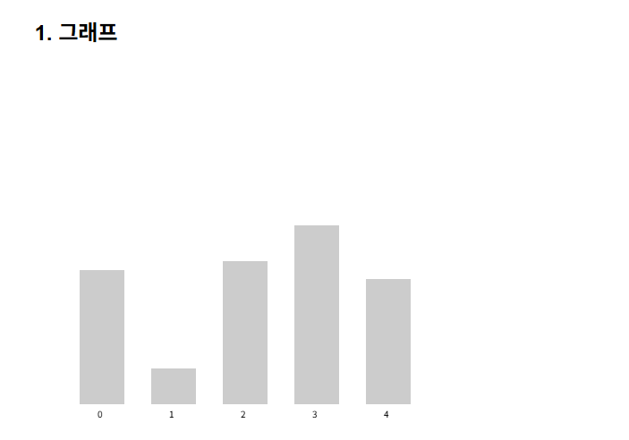
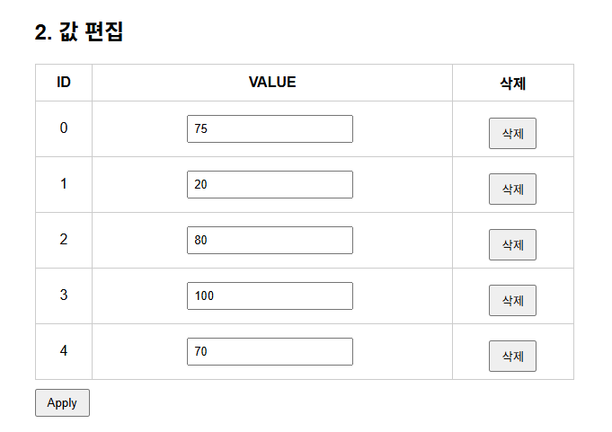
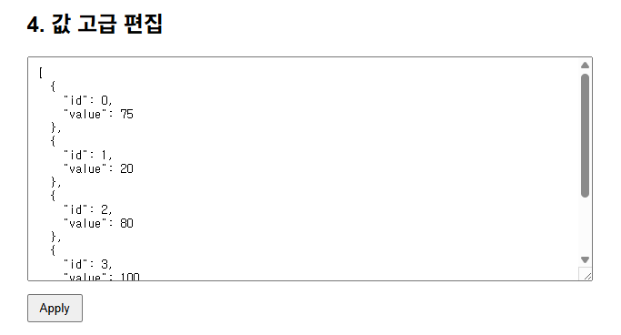

# 자바스크립트 인터랙티브 막대 차트 어플리케이션

## 📌 프로젝트 개요

본 프로젝트는 아이엠파인 SD팀의 자바스크립트 개발자 면접 과제로, JavaScript, HTML, CSS만을 사용하여 인터랙티브한 막대 차트 어플리케이션을 구현하였습니다.<br/>
외부 프레임워크나 라이브러리를 사용하지 않고, 기본적인인 웹 기술만으로 데이터 시각화 및 CRUD 기능을 제공합니다.

## 🎯 주요 기능

1. **그래프 시각화**

   - `canvas` 요소를 활용하여 데이터의 막대 차트를 동적으로 렌더링합니다.
   - 데이터의 최대값을 기준으로 각 막대의 높이를 비례하여 계산합니다.

2. **값 편집**

   - 표 형태로 기존 데이터를 나열하며, 각 값은 `input` 요소를 통해 수정 가능합니다.
   - `Apply` 버튼 클릭 시 차트, 테이블, JSON 영역이 동시에 업데이트됩니다.

3. **값 추가**

   - 새로운 데이터를 ID와 VALUE를 입력하여 추가할 수 있습니다.
   - `Add` 버튼 클릭 시 모든 컴포넌트가 즉시 갱신됩니다.

4. **값 고급 편집**
   - JSON 형식의 텍스트 영역을 통해 데이터를 직접 편집할 수 있습니다.
   - `Apply` 버튼 클릭 시 입력된 JSON을 파싱하여 데이터에 반영하고, 모든 컴포넌트를 업데이트합니다.

## 🛠️ 상세 구현 설명

### 1. 데이터 구조

```javascript
let data = [
  { id: 0, value: 75 },
  { id: 1, value: 20 },
  { id: 2, value: 80 },
  { id: 3, value: 100 },
  { id: 4, value: 70 },
];
```

- `data` 배열은 전역으로 선언되며, 각 객체는 `id`와 `value`를 속성으로 가집니다.
- 모든 컴포넌트는 이 배열을 기반으로 렌더링되며, 변경 시 `updateAll()` 함수를 통해 동기화됩니다.

### 2. 주요 함수 설명

- **updateAll()**

  - 차트, 테이블, JSON 영역을 동시에 업데이트하는 함수입니다.

- **drawChart()**

  - `canvas`를 초기화하고, `data` 배열을 순회하며 막대를 그립니다.
  - 막대의 높이는 최대값 대비 비율로 계산되며, 각 막대 아래에 `id`를 표시합니다.

- **drawTable()**

  - HTML 테이블을 생성하여 `data` 배열의 각 항목을 행으로 렌더링합니다.
  - 각 행에는 `id`, `value` 입력 필드, 삭제 버튼이 포함됩니다.

- **updateJson()**

  - `data` 배열을 JSON 문자열로 변환하여 텍스트 영역에 표시합니다.

- **add()**

  - 입력된 `id`와 `value`를 검증 후 `data` 배열에 추가합니다.
  - 중복된 `id`가 있을 경우 경고를 표시합니다.

- **edit(index, newValue)**

  - 지정된 인덱스의 `value`를 새로운 값으로 업데이트합니다.
  - 입력값이 숫자가 아닐 경우 경고를 표시합니다.

- **del(index)**

  - 지정된 인덱스의 항목을 `data` 배열에서 제거합니다.

- **apply()**

  - 현재 `data` 배열을 기반으로 모든 컴포넌트를 업데이트합니다.

- **applyJson()**
  - 텍스트 영역의 JSON을 파싱하여 `data` 배열을 업데이트합니다.
  - 형식이 올바르지 않을 경우 경고를 표시합니다.

### 3. HTML 구조

- **header**

  - 페이지 상단에 지원자의 이름을 표시합니다.


- **section 1: 그래프**

  - `canvas` 요소를 통해 막대 차트를 렌더링합니다.



- **section 2: 값 편집**

  - 테이블 형태로 데이터를 나열하며, 각 값은 수정 가능합니다.
  - `Apply` 버튼을 통해 변경사항을 반영합니다.



- **section 3: 값 추가**

  - 새로운 `id`와 `value`를 입력하여 데이터를 추가할 수 있습니다.


- **section 4: 값 고급 편집**
  - JSON 형식의 텍스트 영역을 통해 데이터를 직접 편집할 수 있습니다.
  - `Apply` 버튼을 통해 변경사항을 반영합니다.



### 4. CSS 스타일링

- 전체적인 레이아웃은 `.container` 클래스를 중심으로 구성되며, 최대 너비는 600px로 제한하여 가독성을 높였습니다.
- 테이블, 입력 필드, 버튼 등은 기본적인 스타일링을 적용하여 사용자 경험을 향상시켰습니다.

## 📁 파일 구조

```
├── index.html       // HTML 구조 정의
├── index.css        // 스타일 정의
└── main.js          // JavaScript 로직 구현
```

## 🚀 실행 방법

1. 레포지토리를 클론하거나 다운로드합니다.
2. `index.html` 파일을 브라우저(chrome)에서 열어 애플리케이션을 실행합니다.

## ✅ 유효성 검사 및 예외 처리

- `id`와 `value` 입력 시 숫자 여부를 검사하며, 유효하지 않을 경우 `alert`를 표시합니다.
- 중복된 `id` 입력 시 `alert`를 표시하여 데이터 중복을 방지합니다.
- JSON 편집 시 올바른 형식인지 검사하며, 오류가 있을 경우 `alert`를 표시합니다.

## 🧠 개발자 참고 사항

- 모든 함수에는 상세한 주석을 추가하여 코드의 가독성과 유지보수성을 높였습니다.
- 외부 라이브러리 없이 순수 JavaScript로 구현하여 기본기에 충실한 코드를 작성하였습니다.
- 코드의 구조를 명확히 하여 확장성과 재사용성을 고려하였습니다.

## 📄 라이선스

본 프로젝트는 면접 과제 제출용으로 작성되었으며, 별도의 라이선스는 적용되지 않습니다.
